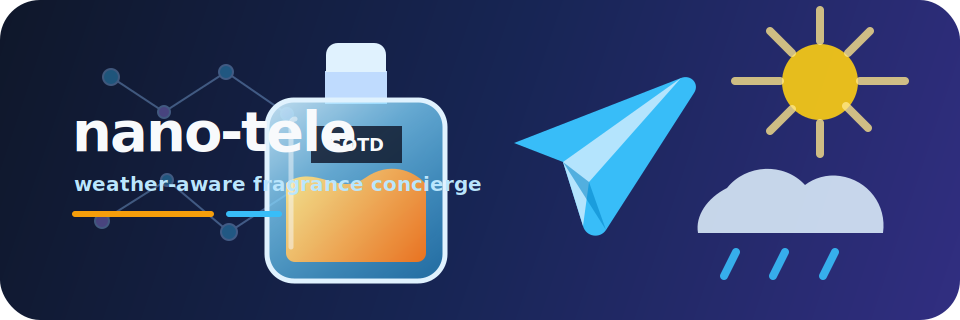

# nano-tele

<p align="center">
  
</p>

A personal fragrance concierge Telegram bot powered by [nanobot-ai](https://github.com/hkuds/nanobot) and OpenRouter. It recommends perfumes from a curated collection using deterministic local selection logic and live weather data.

## What It Does

- **Weather-aware recommendations** — Fetches structured Open-Meteo weather for your city and matches it to the best fragrance from a personal collection.
- **Telegram-native** — Replies in a concise, emoji-friendly format optimised for mobile chat.
- **Collection-only** — Never suggests perfumes outside the saved collection.
- **Deterministic rotation** — Avoids same-fragrance consecutive-day repeats and logs every recommendation.
- **Feedback-aware ranking** — Learns from liked/disliked scents and performance notes.
- **Travel mode** — Temporarily changes the default recommendation city.
- **Collection management** — Lists, adds, and removes fragrances from the local collection data.
- **Scheduled reminders** — Supports cron-based reminders and heartbeat tasks for recurring checks.

## Architecture

```
User (Telegram)  <--->  nanobot gateway  <--->  Agent (LLM + deterministic tool + memory)
                              |
                        + Health check server
```

- **Gateway** — Routes Telegram messages to the agent and back.
- **Agent** — Configured via markdown files in `workspace/` (SOUL, AGENTS, USER, TOOLS, HEARTBEAT).
- **Perfume tool** — `workspace/tools/perfume_tool.py` handles weather, selection, rotation, feedback, history, travel mode, and collection commands.
- **Data** — `workspace/data/fragrances.json` and `workspace/data/ranking.json` are the executable fragrance source of truth.
- **Skills** — Domain documentation lives in `workspace/skills/perfume-advisor/`.
- **Memory** — Session history and memory are persisted in `workspace/memory/` and `workspace/sessions/`.

## Tech Stack

| Component | Technology |
|-----------|------------|
| Framework | `nanobot-ai` (Python MCP agent framework) |
| LLM | DeepSeek V3 via OpenRouter |
| Channel | Telegram Bot API |
| Weather | Open-Meteo (no API key required) |
| Search | DuckDuckGo |

## Project Structure

```
.
├── main.py              # Entry point: launches nanobot gateway + health server
├── config.json          # Agent, channel, provider & tool configuration
├── requirements.txt     # Python dependencies
├── tests/               # unittest coverage for deterministic selection
├── workspace/cron/      # Scheduled job definitions
├── history/             # CLI history
└── workspace/
    ├── SOUL.md          # Bot identity, personality & core rules
    ├── AGENTS.md        # Instruction workflows (perfume recommendation steps)
    ├── USER.md          # Owner profile & preferences
    ├── TOOLS.md         # Tool usage notes & safety limits
    ├── HEARTBEAT.md     # Recurring periodic tasks
    ├── data/
    │   ├── fragrances.json
    │   ├── ranking.json
    │   └── preferences.json
    ├── tools/
    │   └── perfume_tool.py
    ├── skills/
    │   └── perfume-advisor/
    │       └── SKILL.md # Fragrance collection & weather pairing rules
    ├── memory/          # Persistent memory storage
    └── sessions/        # Active conversation sessions
```

## Getting Started

### 1. Install dependencies

```bash
pip install -r requirements.txt
```

### 2. Set environment variables

```bash
export TELEGRAM_BOT_TOKEN="<your-bot-token>"
export OR_API_KEY="<your-openrouter-api-key>"
export ALLOW_FROM="<your-telegram-user-id>"
export ALLOW_FROM_2="<optional-second-user-id>"
```

### 3. Run the bot

```bash
python main.py
```

The gateway starts on port `18790` (override with `NANOBOT_PORT`). If a platform `PORT` is set, a health-check server also starts on that port.

## How Recommendations Work

1. **Fetch weather** via Open-Meteo geocoding + current weather + forecast for the requested city.
2. **Classify** into a weather bucket (Hot & dry, Hot & humid, Mild, Cool & dry, Cold & dry, Cold & rainy).
3. **Infer occasion** (office, daytime, evening) from time and keywords.
4. **Apply feedback and rotation** using `workspace/memory/RECENT_PICKS.md` and `workspace/data/preferences.json`.
5. **Select** the top-ranked eligible perfume from the collection that matches both weather and occasion.
6. **Log and reply** with two lines: a weather summary and the fragrance pick with a one-line reason.

Example output:

```
🌤️ *Sheffield: 18°C, partly cloudy, 55% humidity*
💨 Wear **Sauvage by Dior** — woody fresh bergamot and pepper, perfect for mild daytime conditions.
```

## Configuration Highlights

| Config | Value |
|--------|-------|
| Model | `deepseek/deepseek-chat` |
| Provider | `openrouter` |
| Max tokens | 4096 |
| Temperature | 0.2 |
| Timezone | Europe/London |
| Dream interval | Every 2 hours (`agents.defaults.dream.intervalH`) |
| Gateway heartbeat interval | Every 30 minutes (`gateway.heartbeat.intervalS = 1800`) |
| Tool exec timeout | 60s |
| Web search | DuckDuckGo, max 1 result |

## Commands

These are implemented through `workspace/tools/perfume_tool.py` and are exposed to the agent through `AGENTS.md`.

| Command | Purpose |
|---------|---------|
| `/today` | Daytime recommendation for the active city |
| `/office` | Office-safe recommendation |
| `/evening` | Evening recommendation |
| `/date` | Date-night recommendation |
| `/history` | Last 7 recommendations |
| `/stats` | SOTD stats: most worn, least worn, weather spread |
| Travel mode | "I'm in Dubai for 5 days" or "clear travel mode" |
| Feedback | "I liked Sauvage, lasted well" or "Erba Pura was too sweet" |
| Collection | "show my collection", "add ...", "remove ..." |

The installed Nanobot Telegram channel does not currently expose inline keyboard reply markup, so shortcut commands are used instead of native Telegram buttons.

## Local Tool Usage

```bash
sh workspace/tools/perfume recommend --occasion office --city "Sheffield"
sh workspace/tools/perfume history --limit 7
sh workspace/tools/perfume stats
sh workspace/tools/perfume travel "Dubai"
sh workspace/tools/perfume travel --clear
sh workspace/tools/perfume collection list
sh workspace/tools/perfume route --text "/today"
```

## Tests

```bash
/Users/ohm/Documents/projects/pyenvs/sandbox/bin/python -m unittest discover -s tests
```

On Railway, Nanobot should call the workspace wrapper (`sh tools/perfume ...`) from inside `workspace/`; the wrapper selects `python3` or `python` from Railway's active environment.

## Customising

- **Change city** — Edit `USER.md` default location.
- **Update collection** — Prefer `workspace/data/fragrances.json` or the collection command; keep `workspace/skills/perfume-advisor/SKILL.md` in sync as documentation.
- **Update ranking** — Edit `workspace/data/ranking.json`.
- **Tweak personality** — Edit `SOUL.md`.
- **Add heartbeat tasks** — Edit `HEARTBEAT.md`.
- **Switch model** — Change `model` in `config.json` (any OpenRouter model).

## Deployment Notes

- Nanobot uses a **gateway** process that stays alive and routes Telegram webhooks/polling.
- `restrictToWorkspace: true` in `config.json` keeps file tools scoped to `./workspace/`.
- The built-in health server responds with `ok` on `PORT` for platform health checks (e.g. Railway, Render).

## Resources

- [Nanobot GitHub](https://github.com/hkuds/nanobot)
- [OpenRouter](https://openrouter.ai)
- [Telegram Bot API](https://core.telegram.org/bots)
- [Open-Meteo](https://open-meteo.com)
